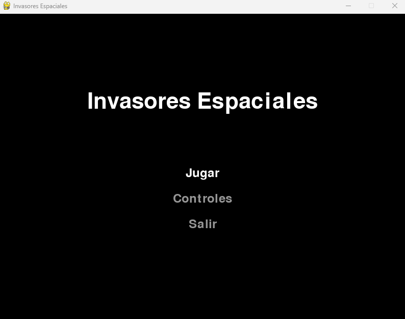
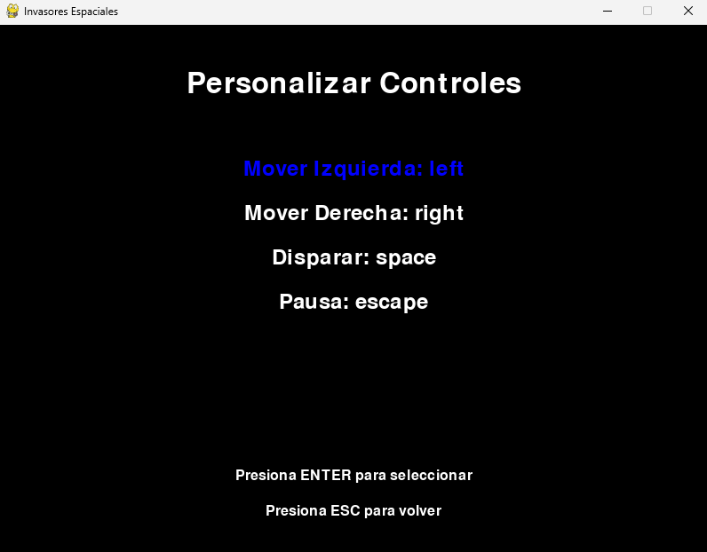
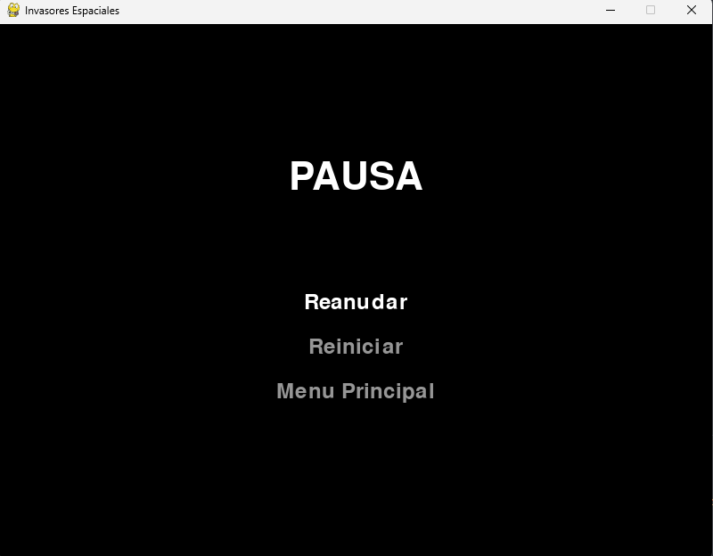
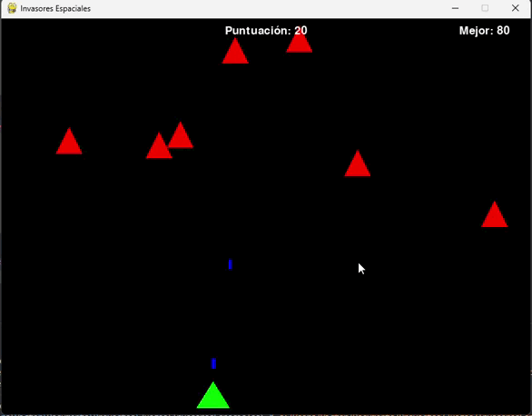

# Invasores Espaciales

## Descripción
Invasores Espaciales es un juego de arcade clásico desarrollado en Python utilizando Pygame. El jugador controla una nave espacial y debe defender la Tierra de una invasión alienígena, disparando a las naves enemigas mientras evita ser destruido.

## Características
- Jugabilidad clásica de disparos espaciales
- Sistema de puntuación con guardado de mejores puntajes
- Controles personalizables
- Menú principal interactivo
- Sistema de pausa
- Gráficos vectoriales simples y efectivos

## Capturas

### Menu principal

### Controles

### Menu de pausa

### Juego

## Requisitos
- Python 3.7 o superior
- Pygame 2.0.0 o superior

## Controles Predeterminados
- Flecha Izquierda: Mover nave a la izquierda
- Flecha Derecha: Mover nave a la derecha
- Barra Espaciadora: Disparar
- ESC: Pausar juego

## Personalización
Los controles pueden ser personalizados desde el menú principal seleccionando la opción "Controles". Los cambios se guardarán automáticamente en `controles.txt`.

## Almacenamiento de Datos
- Los controles personalizados se guardan en `controles.txt`
- Las mejores puntuaciones se almacenan en `puntuaciones.json`

## Mecánicas del Juego
- Destruye naves enemigas para obtener puntos
- Evita que las naves enemigas te alcancen
- Intenta superar tu mejor puntuación

## Características Técnicas
- Desarrollado con Pygame
- Gráficos vectoriales dibujados proceduralmente
- Sistema de colisiones basado en sprites
- Guardado y carga de configuraciones y puntuaciones
